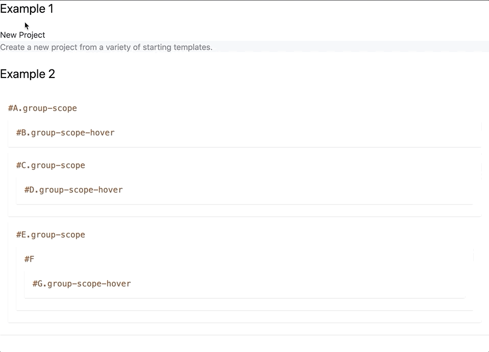

# tailwindcss-nested-groups

Tailwind CSS plugin that adds support nested groups to the `group` variant for any level deep by scoping them.

## Installation

```sh
# npm
npm install tailwindcss-nested-groups --save-dev

# yarn
yarn add --dev tailwindcss-nested-groups
```

## Configuration

Add the plugin to the `plugins` array of the tailwind config file.  

```js
// tailwind.config.js
module.exports = {
  // ...

  plugins: [
    // ...
    require("tailwindcss-nested-groups"),
  ],
};
```

Optionally set your group scope and choose variants in the config (no need to type `group-`, that will be prepended for you).

```js
// tailwind.config.js
module.exports = {
  theme: {
    // ...
    groupLevel: 10,
    // will result in as many direct child selectors as defined here
    groupScope: "scope",
    // will result in group-scope being available in addition to the base group
    groupVariants: ["hover", "focus"],
    // will result in group-scope:hover and group-scope:focus variants
  },
  // ...
};
```

Make sure that your **variants** are enabled.
- See **Tailwind V2** [variants](https://tailwindcss.com/docs/configuring-variants#overview) and [`group-hover`](https://tailwindcss.com/docs/hover-focus-and-other-states#group-hover)/[`group-focus`](https://tailwindcss.com/docs/hover-focus-and-other-states#group-focus)
- See **Tailwind V1** [variants](https://v1.tailwindcss.com/docs/configuring-variants) and [`group-hover`](https://v1.tailwindcss.com/docs/pseudo-class-variants#group-hover)/[`group-focus`](https://v1.tailwindcss.com/docs/pseudo-class-variants#group-focus)

```js
// tailwind.config.js
module.exports = {
  // ...
  variants: {
    // Now you can use nested groups for example in backgroundColor and textColor for hover and focus
    backgroundColor: ['responsive', 'hover', 'focus', 'group-hover', 'group-focus'],
    textColor: ["responsive", "hover", "focus", "group-hover", "group-focus"],
  },
};
```

## Usage

Use the `.group-scope` alternative (you can play with it [here](https://play.tailwindcss.com/LynJHjqDNU)):

```html
<div class="space-y-6">
  <h1 class="text-2xl">Example 1</h1>
  <div class="group-scope bg-white hover:bg-blue-500 ...">
    <p class="text-gray-900 group-scope-hover:text-white ...">New Project</p>
    <div class="group-scope bg-gray-100 hover:bg-green-500 ...">
      <p class="text-gray-500 group-scope-hover:text-yellow-400 ...">Create a <span class="group-scope-hover:text-red-600">new project</span> from a variety of starting templates.</p>
    </div>
  </div>

  <h1 class="text-2xl">Example 2</h1>
  <div id="A" class="p-4 shadow group-scope text-yellow-800">
    <pre>#A.group-scope</pre>
    <div id="B" class="p-4 my-2 shadow group-scope-hover:bg-blue-500 group-scope-hover:text-white">
      <pre>#B.group-scope-hover</pre>
    </div>
    <div id="C" class="p-4 my-2 shadow group-scope">
      <pre>#C.group-scope</pre>
      <div id="D" class="p-4 my-2 shadow group-scope-hover:text-red-500">
        <pre>#D.group-scope-hover</pre>
      </div>
    </div>
    <div id="E" class="p-4 my-2 shadow group-scope">
      <pre>#E.group-scope</pre>
      <div id="F" class="p-4 my-2 shadow p-4">
        <pre>#F</pre>
        <div id="G" class="p-4 my-2 shadow group-scope-hover:text-red-500">
          <pre>#G.group-scope-hover</pre>
        </div>
      </div>
    </div>
  </div>
</div>
```

Will look like or live edit [here](https://play.tailwindcss.com/LynJHjqDNU):



## Disclaimer

This Plugin relies on [CSS negation pseudo-class `:not()`](https://drafts.csswg.org/selectors-3/#negation).
